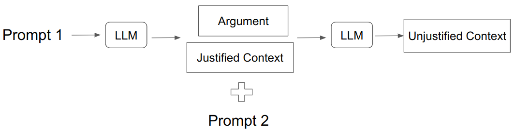

### Initial Setup
if using the apis, add a local file named openrouter_key.txt

### Create Env (In alex cluster)

module load python

python3 -m venv emotions

source emotions/bin/activate

pip install -r requirements.txt

### Dataset

Both datasets `EmAp-r1` and `EmAp-gpt` can be found in the `datsets` directory.

#### Generation

For local inference (requires at least 40GB VRAM)
```python
python datasets/dataset_generator.py
```

If openai_api key is available, create a file called "openrouter_key.txt" in the same
level as the dataset__generator.py file and run the following:

```python
python datasets/dataset_generator_api.py
```
step1 and step2 are run one after the other.

### Evaluation

The rating matrix with aggeragetad metrics can be computed and saved to a YAML file with 
```python
python evaluation/results.py
```

All the plots can be generated with
```python
python evaluation/plots.py
```


