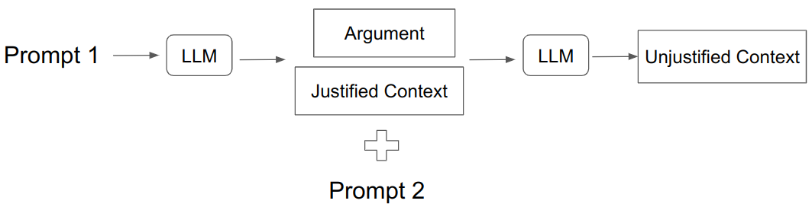
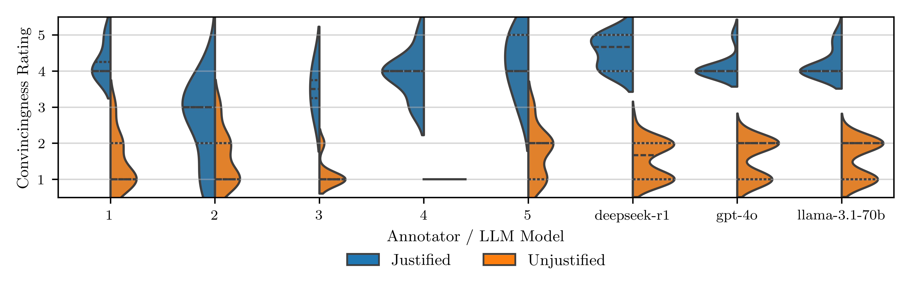

# Emotions: Justified vs. Unjustified Emotional Appeals in Arguments

## Overview

This project studies how **justified** vs. **unjustified** emotional appeals affect an argument’s **convincingness**. We:

- generate synthetic **argument–context** pairs with LLMs,
- annotate convincingness with humans and LLMs,
- compute agreement and significance tests,
- and produce analysis plots.

> **Abstract**: Emotional appeal influences the persuasiveness of arguments. With the advent of Large Language Models (LLMs), the ability to automatically generate emotionally resonant arguments has become a significant area of study.
> However, prior work has not sufficiently investigated how the justification of an emotional appeal within a given context influences an argument's perceived convincingness.
> In this work, we discuss and evaluate the emotional appeal of arguments automatically generated by LLMs, forming two new datasets. Given an argument and its context, we measure the impact of the  emotional appeal on the argument convincingness. With results from 10 annotators, we find that justified emotional appeals have positive effects on the convincingness. Also, human evaluators show more nuance in annotations than LLMs.


## Pipeline



## Quickstart

### Initial Setup

For using the apis, add a local file named openrouter_key.txt

### Create Env (In alex cluster)

```bash
module load python
python3 -m venv emotions
source emotions/bin/activate
pip install -r requirements.txt
```

## Dataset

Both datasets `EmAp-r1` and `EmAp-gpt` can be found in the `datsets` directory.

| Dataset      | #Arguments (Narg) | Total pairs (Ntot) | LLM used    |
| ------------ | ----------------- | ------------------ | ----------- |
| `EmAp-r1`  | 10                | 54                 | DeepSeek-R1 |
| `EmAp-gpt` | 10                | 63                 | GPT-4o mini |

### Generation

For local inference (requires at least 40GB VRAM)

```python
python datasets/dataset_generator.py
```

If an openai_api key is available, create a file called `openrouter_key.txt` in the root and run the following:

```python
python datasets/dataset_generator_api.py
```

Step1 and step2 are run one after the other.

### Evaluation

The rating matrix with aggeragetad metrics can be computed and saved to a YAML file with

```python
python evaluation/results.py
```

All the plots can be generated with

```python
python evaluation/plots.py
```



### LLM as a Judge

To run the LLM evaluation for a dataset, simply execute this line in the root folder:

```python
PYTHONPATH=. python evaluation/llm_judge.py
```

The three models we used for the evaluation are available for selection in the script. Simply comment out the model for which you would like to run the evaluation.

When the evaluation is complete, the results are saved in the `outputs/` folder.
